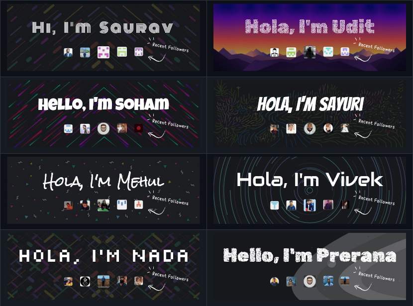

<div align="center">
 
 <h2 align="center">❄️ GITHUB COOL COVERS ❄️</h2>
 <p align="center">Get dynamically generated 🌐 GitHub covers for your readmes!</p>
 <a href="https://github-cool-covers.vercel.app" target="_blank">
 
 </a>
</div>
 <br />

<div align="center">
 
 
 
 <br />
 <!--  -->
 
 
 
 
 <!--  -->
 </div>


# ⭐ Features

- Dynamically 🤖 generated covers with cool patterns.
- Updates the recent followers ✏️ avatars (in 1 or 2 days).
- Eight unique 😊 background patterns.
- Supports all 🕸️ [Web Safe Fonts](https://www.w3schools.com/cssref/css_websafe_fonts.asp) + 🤩 [Google Fonts](https://fonts.google.com/).
- Highly Customizable 📝.

# 📌 How 2️⃣ Use?

Copy-paste this into your markdown content, and that's it. Simple!

Change the `username=` value to your GitHub's username.

Change the `text=` value to update cover's title.

```md
[](https://github.com/uditkumar01/cool-covers)
```

### 🔤 Change Font

To change the font, you can pass a query parameter `?fontFamily=` with the font name.

> Example: `&fontFamily=Roboto`

```md

```

<em>Note: The font name must be a valid font name (**case sensitive**). For Google fonts u can directly copy the name of the font from here: <a href="https://fonts.google.com/">Google Fonts</a></em>

### 🐤 Change Font Size

You can change the font size by passing a query parameter `?textFontSize=` with the font size.

> Example: `&textFontSize=4rem`

```md

```

<em>Note: The font size can be any number or string.</em>

### ⚒️ Change Font Weight

To change the font weight, you can pass a query parameter `?textFontWeight=` with the font weight.

> Example: `&textFontWeight=400`

```md

```

<em>Note: The font weight can be `light/regular/bold/bolder/lighter` or any number.</em>

### 🎨 Change Background Color

With the help of the `?bgColor=` query parameter, you can change the background color of the cover.

Use `?bgColor=` with the **hex code without #** of the color you want to use.

> Example: `&bgColor=000000`

```md

```

### :four_leaf_clover: Change Text Color

Using `?textColor=` query parameter, you can change the text color of the cover.

Use `?textColor=` with the **hex code without #** of the color you want to use.

> Example: `&textColor=ffffff`

```md

```

### 💎 Add Background Pattern

To add a background pattern, you can pass a query parameter `?pattern=` with the pattern name.

> Example: `&pattern=p2`

```md

```

If you wish **you can 💻 contribute by creating a new pattern and designs.**

<em>Note: Currently, eight patterns are available. `p1` to `p8`.</em>

### 🔥 Add Grayscale Effect

Using `?grayscale=` query parameter, you can add a grayscale effect to the cover's background pattern.

✅ Empty query parameter will remove the grayscale effect.

✅ Non-empty the query parameter to add the grayscale effect.

> Example: `&grayscale=true` // Adds the grayscale effect.

> Example: `&grayscale=''` // Removes the grayscale effect.

```md

```

### :large_blue_circle: Change Avatar Radius

You can easily change the avatar radius of recent followers by passing a query parameter `?avatarRadius=` with the radius value.

Its value should be a number (can have any unit like px, rem, em, etc).

> Example: `&avatarRadius=50`

```md

```

### 📌 Change Cover's Title Word Spacing
You can customize the word spacing of the cover's title by passing a query parameter `?textWordSpacing=` with the spacing value.

Its value should be a number (can have any unit like px, rem, em, etc).

> Example: `&textWordSpacing=25px`

```md

```

### 📌 Change Cover's Title Letter Spacing
You can customize the letter spacing of the cover's title by passing a query parameter `?textLetterSpacing=` with the spacing value.

Its value should be a number (can have any unit like px, rem, em, etc).

> Example: `&textLetterSpacing=25px`

```md

```

### 🖼️ All Different Patterns




<!-- get table of able images 2 cols -->
<!--
<table>
    <tr>
        <td>
            
        </td>
        <td>
            
        </td>
    </tr>
    <tr>
        <td>
            
        </td>
        <td>
            
        </td>
    </tr>
    <tr>
        <td>
            
        </td>
        <td>
            
        </td>
    </tr>
    <tr>
        <td>
            
        </td>
        <td>
            
        </td>
    </tr>
</table>
-->

<h3 align="center">⭐ Star this project on GitHub</h3>

<p align="center">Made with ❣️ and JavaScript.</p>

<br />

<p align="center"><a href="https://www.buymeacoffee.com/uditkumar01" target="_blank"></a></p>
